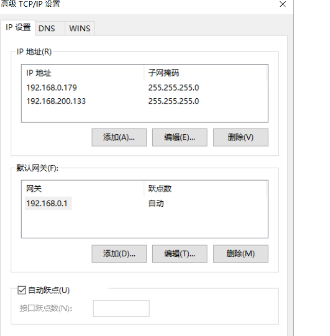

```shell 
git remote add origin https://github.com/Hollin-git/Hollon-git.github.io.git
git branch -M main
git push -u origin main

echo "# Hollon-git.github.io" >> README.md
git init
git add README.md
git commit -m "first commit"
git branch -M main
git remote add origin https://github.com/Hollin-git/Hollon-git.github.io.git
git push -u origin main

```
// 书签
<!-- See my [About](/about/authorauthor.md) page for details. -->
## asd

